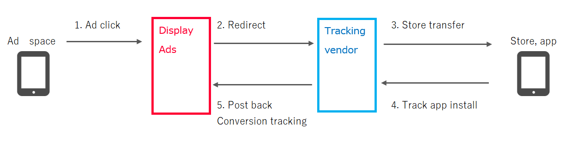

# Specification document of connecting conversion tracking
## About this document
This document introduces how conversion information tracked by the vendor is connected to Yahoo! Display Ads (YDA).

### Connecting method for ad click
Following diagram describes the overview of connecting method for conversion tracking.

|No| category | description |
|:--|:--|:--|
|1|Ad click|Sends ad click information to YDA tracking server|
|2|Parameter connection (redirect)|Sends ad click information from YDA tracking server to tracing vendor based on ad information. |
|3|Store transfer|Transfer from tracking vendor to app store (LP)）|
|4|Track app install|When a user installs the app, tracking vendor records the install.|
|5|Post back|Tracking vendor sends YDA that conversion occurred. This triggers tracking conversion by ad click on YDA.|

### Connecting method for video ad view
Following diagram describes the overview of connecting method for conversion tracking.

|No| category | description |
|:--|:--|:--|
|1|Video ad view|Sends ad video view (10 sec) information to YDA  tracking server|
|2|Parameter connection (tag fires)|Sends the beacon from YDA tracking server to tracking vendor based on ad information and connects conversion tracking parameter|
|3|Store transfer|Transfer from app, search, ads, etc. to app store. *Does not transfer to app store if the event in the app is the achievement point |
|4|Track app install|When a user installs the app, tracking vendor records the install.|
|5|Post back|Tracking vendor sends YDA that conversion occurred. This triggers tracking conversion by video ad view (paid) on YDA.|

This document describes No.2 on the diagram above. 
Detail setting to connect conversions (No.5) will be sent separately.

 
## Connection setting with the ad click and video ad view (Setting information on No.2)
When a user clicks the ad or views the video ad, conversion tracking parameter for YDA will be connected to the tracking vendor.
Here is how to set conversion tracking parameter to be connected.

### Parameter setting
|Parameter|Required|Description|Note|
|:--|:--|:--|:--|
|{ci}|Selectable （*1）|Session information provided by ad click and video ad view (paid).|*1 One from {ci} or {installCallback} is required. |
|{installCallback}|Selectable （*1）|URL when conversion requested. Same request URL as "Connection setting with conversion tracking (Setting information on No.5)"|*1 One from {ci} or {installCallback} is required.|
|{ifa}|No|"Ad identifier (IDFA [iOS ad ID] or Google Advertising ID [Android ad ID]). Character strings “optout” when opted out.|IDFA: in uppercase.  Google Advertising ID: in lowercase.|
|{ifaSha1}|No|Ad identifier (sha1) hash. Character strings “optout” when opted out.|No|
|{ifaMd5}|No|Ad identifier (Md5) hash. Character strings “optout” when opted out.|No|

See below for the other parameters available.
[[Display Ads ]Parameters for Destination URL](linkurl_tracking-parameter.md)

 
### Sample
|items|sample|
|:--|:--|
|Domain of tracking vendor|http://tracking.conv.com|
|Parameter to connect session information of YDA   *The vendor can change the parameter name. |yjci|
|Parameter to connect ad identifier ※*The vendor can change the parameter name. |idfa|
|Landing page URL set|http://tracking.conv.com?yjci={ci}&idfa={ifa}|
|Example of actual tracking URL|http://tracking.conv.com?yjci= xxxxxxxxxxxxxxxxxx &idfa=12345678-1234-1234-1234-123456789012|

*Tracking vendor needs to take over and store the session connected as parameter.
*URL set can be same URL for ad click and video ad view or different URL for each action as well.

### Note
This method is as of July 2018.

 
## Connection setting with conversion tracking (Setting information on No.5)
When tracking vendor records the app install via YDA ad, the conversion information will be connected to YDA.
Information required for requests such as endpoints will be notified in a separate file.
