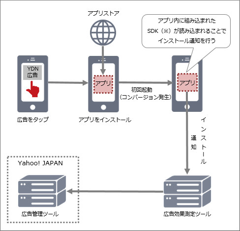
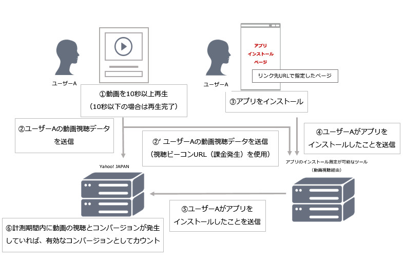

# アプリコンバージョン計測連携仕様
## 本ページについて
本資料ではベンダー側で計測されたコンバージョン情報をYahoo!広告 ディスプレイ広告（以下、YDA）に連携する方法についてご紹介いたします。

## 連携方法概要
コンバージョン計測の連携方法の概要を以下に示します。

### 広告クリック時の連携方法
広告をクリックし、パラメータを連携することでコンバージョン計測します。

|No|内容|詳細|
|:--|:--|:--|
|1|広告クリック|YDA計測サーバーに広告クリックの情報を通信|
|2|パラメータ連携（リダイレクト）|入稿情報をもとに、YDA計測サーバーから計測ベンダーにリダイレクトし、コンバージョン計測用のパラメータを連携|
|3|ストア遷移|計測ベンダーからアプリストアに遷移（LP）|
|4|アプリインストール計測|ユーザーがアプリをインストールすると、計測ベンダーがインストールを計測|
|5|ポストバック|計測ベンダーからYDAに対してコンバージョンが発生したことを通信。これによりYDAでも広告クリックによるコンバージョンが計測される|

### 動画広告視聴時の連携方法
動画広告を課金ポイントもしくはそれに相当するまで再生した場合、クリックと同様コンバージョンに紐付ける事ができます。

|No|内容|詳細|
|:--|:--|:--|
|1|動画広告視聴（10秒再生）|YDA計測サーバーに動画広告視聴（10秒再生）の情報を通信|
|2|パラメータ連携（タグ発火）|入稿情報をもとに、YDA計測サーバーから計測ベンダーにビーコンを送信し、コンバージョン計測用のパラメータを連携|
|3|ストア遷移|アプリ、検索、広告等からアプリストアに遷移|
|4|アプリインストール計測|ユーザーがアプリをインストールすると、計測ベンダーがインストールを計測|
|5|ポストバック|計測ベンダーからYDAに対してコンバージョンが発生したことを通信。これによりYDAにおいて動画広告視聴（課金対象）によるコンバージョンが計測される|

本資料では、上記のパラメータ連携の設定方法(No.2の設定情報)についてご説明いたします。 
コンバージョン計測時の連携設定（No.5の設定情報）につきましては別途詳細をお送りいたします。
 
## 広告クリック、動画広告視聴時の連携設定（No.2の設定情報）
ユーザーが広告をクリック、または動画広告を視聴した時にYDAのコンバージョン計測用のパラメータを計測ベンダーへ連携します。
以下では連携するコンバージョン計測用のパラメータの設定方法を説明します。

### 設定パラメータ
|パラメータ|必須|概要|備考|
|:--|:--|:--|:--|
|{ci}|△（*1）|広告クリック、動画広告視聴（課金対象）時に発行されるセッション情報|*1 どちらか一方が必須|
|{installCallback}|△（*1）|コンバージョンリクエスト時のURL。『コンバージョン計測時の連携設定（No.5の設定情報）』のリクエストURLと同様|*1 どちらか一方が必須|
|{ifa}| |広告識別子（IDFA（iOS 用広告ID）もしくはGoogle Advertising ID（Android 用広告ID）） 例：76312587-194F-4089-9932-622632AFB85A オプトアウト時は、文字列でoptout|IDFA：アルファベットは大文字 Google Advertising ID：アルファベットは小文字|
|{ifaSha1}| |広告識別子のハッシュ値（sha1）オプトアウト時は、文字列でoptout||
|{ifaMd5}| |広告識別子のハッシュ値（Md5）オプトアウト時は、文字列でoptout||

その他の設定可能パラメータについてはこちらのページをご参照ください。
[[ディスプレイ広告]インプレッション計測URL用パラメータ一覧](impression_tracking-parameter.md)

 
### サンプル
|項目|内容|
|:--|:--|
|計測ベンダーのドメイン|http://tracking.conv.com|
|YDAのセッション情報を連携するためのパラメータ ※パラメータ名はベンダー側で変更可能です|yjci|
|広告識別子を連携するためのパラメータ ※パラメータ名はベンダー側で変更可能です|idfa|
|URLの設定|http://tracking.conv.com?yjci={ci}&idfa={ifa}|
|実際の計測URLの例|http://tracking.conv.com?yjci= xxxxxxxxxxxxxxxxxx &idfa=12345678-1234-1234-1234-123456789012|

※計測ベンダーはパラメータとして連携されたセッション情報を引き継ぎ、保管する必要があります。
※設定するURLは広告クリック時と動画広告視聴時で共通のURL、もしくは別のURLのどちらでも設定できます。

### 注意
この設定方法は2018年10月時点のものです。

 
## コンバージョン計測時の連携設定（No.5の設定情報）
計測ベンダーがYDA広告経由のアプリインストールを計測した際に、YDAにコンバージョン情報を連携します。
エンドポイント等リクエストに必要な情報は別ファイルにてお知らせいたします。
